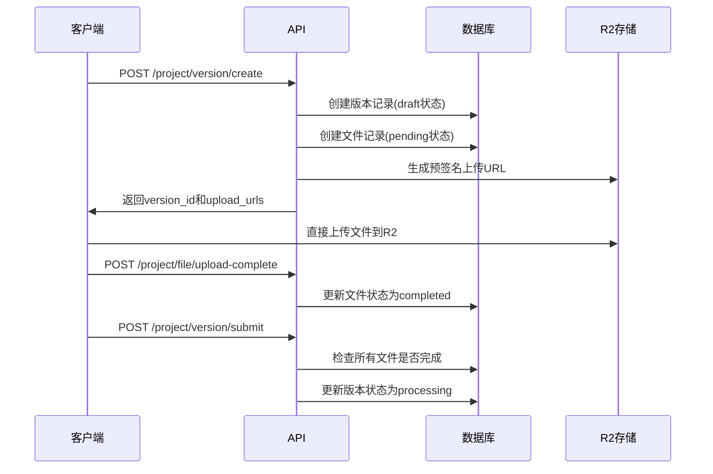

```mermaid
sequenceDiagram
    participant C as 客户端
    participant A as API
    participant DB as 数据库
    participant R2 as R2存储

    C->>A: POST /project/version/create
    A->>DB: 创建版本记录(draft状态)
    A->>DB: 创建文件记录(pending状态)
    A->>R2: 生成预签名上传URL
    A->>C: 返回version_id和upload_urls

    C->>R2: 直接上传文件到R2
    C->>A: POST /project/file/upload-complete
    A->>DB: 更新文件状态为completed
    
    C->>A: POST /project/version/submit
    A->>DB: 检查所有文件是否完成
    A->>DB: 更新版本状态为processing
``` 